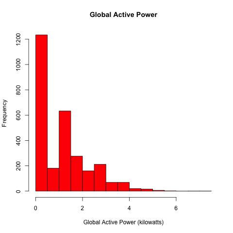

## Exploratory Data Analysis - Course Project 1 

The assignment is to reproduce the plots shown below based on the following data set --

* <b>Dataset</b>: <a href="https://d396qusza40orc.cloudfront.net/exdata%2Fdata%2Fhousehold_power_consumption.zip">Electric power consumption</a> [20Mb]

* <b>Description</b>: Measurements of eectric power consumption in
one household with a one-minute sampling rate over a period of almost
4 years. Different electrical quantities and some sub-metering values
are available.

The following descriptions of the 9 variables in the dataset are taken
from
the <a href="https://archive.ics.uci.edu/ml/datasets/Individual+household+electric+power+consumption">UCI
web site</a>:

<ol>
<li><b>Date</b>: Date in format dd/mm/yyyy </li>
<li><b>Time</b>: time in format hh:mm:ss </li>
<li><b>Global_active_power</b>: household global minute-averaged active power (in kilowatt) </li>
<li><b>Global_reactive_power</b>: household global minute-averaged reactive power (in kilowatt) </li>
<li><b>Voltage</b>: minute-averaged voltage (in volt) </li>
<li><b>Global_intensity</b>: household global minute-averaged current intensity (in ampere) </li>
<li><b>Sub_metering_1</b>: energy sub-metering No. 1 (in watt-hour of active energy). It corresponds to the kitchen, containing mainly a dishwasher, an oven and a microwave (hot plates are not electric but gas powered). </li>
<li><b>Sub_metering_2</b>: energy sub-metering No. 2 (in watt-hour of active energy). It corresponds to the laundry room, containing a washing-machine, a tumble-drier, a refrigerator and a light. </li>
<li><b>Sub_metering_3</b>: energy sub-metering No. 3 (in watt-hour of active energy). It corresponds to an electric water-heater and an air-conditioner.</li>
</ol>

## Loading the data

Only the data from 2007-02-01 and 2007-02-02 were used.

PrepData.R - this script downloads the data, if necessary, and uses grep() to
load the correct dates. The script also creates a new column, datetime. The
correct dataframe is returned. The dataframe is also saved as a file which can
be loaded quickly.

## Making Plots

Each of the scripts, plot1.R, plot2.R, plot3.R and plot4.R call PrepData.R to
load the dataframe. After the data is loaded the correct plot is generated.

### Plot 1 -- Reference

 

### Plot 1 -- My Plot

 

### Plot 2 -- Reference

 

### Plot 2 -- My Plot

 

### Plot 3 -- Reference

 

### Plot 3 -- My Plot

 

### Plot 4 -- Reference

 

### Plot 4 -- My Plot

 

